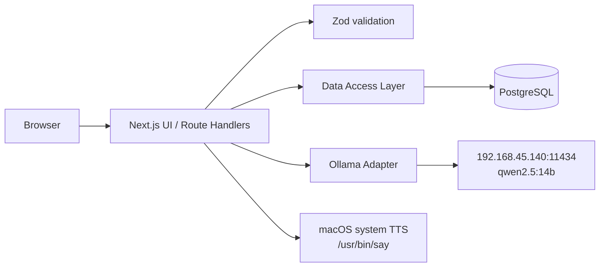

# ToneTalk 시스템 아키텍처

## 목표

ToneTalk MVP는 7개 지원 언어의 문장을 자동 감지하거나 입력 언어를 직접 지정해 다른 언어의 다섯 가지 말투로 번역하고, 결과를 저장·검색·복습하는 단일 사용자 웹 앱이다. 외부 AI API 대신 사설망의 Ollama를 사용하며, 이후 이메일 로그인과 다중 사용자로 확장할 수 있어야 한다.

## 기술 선택

| 영역 | 선택 | 이유 |
|---|---|---|
| 웹·서버 | Next.js App Router + TypeScript | UI와 BFF API를 한 배포 단위로 유지하면서 서버 전용 DB·Ollama 접근을 보장 |
| UI | React + Tailwind CSS + Lucide | 작은 MVP에서 빠르게 일관된 반응형 UI와 접근 가능한 아이콘 구성 |
| TTS | Web Speech API + macOS `say` | 브라우저 음성을 우선 사용하고 미지원 환경에서는 외부 API 없이 로컬 시스템 음성으로 대체 |
| DB | PostgreSQL + Drizzle ORM | 번역·톤·저장 관계, 중복 방지, 검색·정렬, 향후 사용자 소유권을 제약으로 관리 |
| 입력 검증 | Zod | API 입력과 Ollama 구조화 출력을 같은 스키마로 검증 |
| 로컬 LLM | Ollama `qwen2.5:14b` | 1.5B와 3B가 의미 보존 검증에 실패해 정확도를 우선. 불필요한 생성 필드를 제거하고 120초 제한 적용 |
| 테스트 | Vitest | 프롬프트 독립적인 스키마·검증·서비스 로직 회귀 테스트 |

## 런타임 구조

- 브라우저는 Ollama와 PostgreSQL에 직접 접근하지 않는다.
- Route Handler는 입력 검증, 간단한 요청 제한, 서비스 호출, 오류 매핑만 담당한다.
- `src/server`는 `server-only` 경계 안에서 DB와 Ollama를 호출한다.
- UI로 반환되는 데이터는 필요한 필드만 포함한 DTO다.
- 브라우저가 Web Speech API를 제공하지 않으면 앱 서버의 TTS 대체 경로가 macOS 시스템 음성을 호출한다.

## 핵심 흐름

### 번역 생성

1. 브라우저가 `POST /api/translations`로 원문, 입력 언어 또는 `auto`, 대상 언어를 보낸다.
2. 서버가 길이, 지원 언어, 동일 언어 선택, 요청 빈도를 검증한다.
3. Ollama에 언어 감지와 다섯 말투 JSON 형식을 포함한 비스트리밍 요청을 보낸다.
4. 감지 언어와 번역 결과를 Zod로 다시 검증하고 한 번의 DB 트랜잭션으로 세션과 다섯 톤을 저장한다.
5. UI에는 번역 세션 DTO만 반환한다.

### 저장 문장

1. 사용자가 톤 결과의 저장 버튼을 누른다.
2. `POST /api/saved-phrases`가 고정 MVP 소유자와 번역 variant를 묶는다.
3. `(owner_id, variant_id)` 유니크 제약으로 중복 저장을 방지한다.
4. 로그인 도입 시 고정 소유자를 실제 사용자 ID로 교체하고 기존 데이터를 마이그레이션한다.

### 간격 반복 학습

1. `GET /api/study`가 아직 학습하지 않은 저장 문장과 복습 시각이 지난 문장을 조회한다.
2. 사용자는 번역 정답을 공개한 뒤 `again`, `hard`, `good`, `easy` 중 하나로 기억 상태를 평가한다.
3. 서버가 반복 횟수, 간격, 난이도 계수를 사용해 다음 복습 시각을 계산한다.
4. `study_progress`는 문장별 최신 일정만 보관하고 `study_review_events`는 스트릭과 통계를 위한 이력을 보관한다.
5. 일정 UPSERT와 이력 INSERT는 짧은 DB 트랜잭션으로 함께 처리한다.

### 프로필과 학습 설정

1. `app_users`가 표시 이름, 기본 번역 언어, 하루 복습 목표를 보관한다.
2. 번역 화면은 Profile의 기본 언어를 불러와 최초 선택값에 반영한다.
3. Profile API는 번역·저장·숙달·스트릭 통계를 사용자 범위로 집계한다.
4. 로그인 도입 시 현재 Profile API 계약을 유지하고 소유자 확인 방식만 세션 기반으로 교체한다.

### 음성 읽기

1. 번역 결과, 저장 표현, 복습 정답의 듣기 버튼은 Web Speech API를 우선 사용한다.
2. 대상 언어 코드를 `en-US`, `ja-JP`, `ko-KR` 등의 음성 로케일로 매핑하고 가장 가까운 브라우저 음성을 선택한다.
3. Web Speech API가 없거나 재생에 실패하면 `POST /api/tts`로 문장과 언어를 전송한다.
4. 서버는 검증과 요청 제한 후 언어별 macOS 시스템 음성으로 M4A를 생성해 스트리밍하고 임시 파일을 즉시 삭제한다.
5. 한 번에 하나의 문장만 재생하며 다른 문장 선택, 새 번역, 복습 평가, 화면 종료 시 기존 재생과 요청을 중지한다.

## 단일 사용자에서 로그인으로 확장

- 초기 마이그레이션에 `app_users`와 모든 사용자 데이터의 `owner_id`를 포함한다.
- MVP 시작 시 `single-user` 레코드를 seed한다.
- 이메일 로그인 도입 시 `app_users.email`, `password_hash` 또는 외부 인증 subject를 추가한다.
- API의 `getCurrentOwnerId()` 구현만 세션 기반으로 교체하고 DAL의 소유권 조건은 유지한다.

## 신뢰 경계와 운영 원칙

- `DATABASE_URL`, `OLLAMA_BASE_URL`, `OLLAMA_MODEL`은 서버 환경 변수로만 읽는다.
- 클라이언트 입력과 모델 출력은 모두 신뢰하지 않고 검증한다.
- Ollama URL은 허용된 `http/https` URL만 받고 브라우저에 노출하지 않는다.
- 원문·번역문은 애플리케이션 로그에 기록하지 않는다.
- TTS 문장은 셸 문자열이 아닌 프로세스 인자로 전달하며 로그에 남기지 않고, 임시 음성 파일은 응답 생성 직후 삭제한다.
- 복습 평점과 사용자 설정은 애플리케이션 검증과 PostgreSQL CHECK 제약으로 이중 검증한다.
- 모든 외래키 조회·삭제 경로와 사용자별 마감 시각 조회에 맞는 인덱스를 둔다.
- 번역 엔드포인트는 프로세스 단위의 간단한 요청 제한을 제공하며, 다중 인스턴스 전환 시 Redis 기반으로 교체한다.
- Ollama 장애 시 저장 목록은 계속 사용할 수 있다.

## 확장 포인트

- `TranslationProvider` 인터페이스에 다른 로컬 모델 또는 외부 공급자 어댑터 추가
- PostgreSQL 전문 검색·trigram 인덱스로 다국어 검색 고도화
- 이메일 로그인과 사용자별 데이터 격리
- 시간대 설정과 사용자별 학습일 경계를 지원하는 스트릭 계산
- Redis 기반 분산 요청 제한과 응답 캐시
- macOS 이외의 서버를 위한 Piper 등 로컬 TTS 공급자 어댑터
